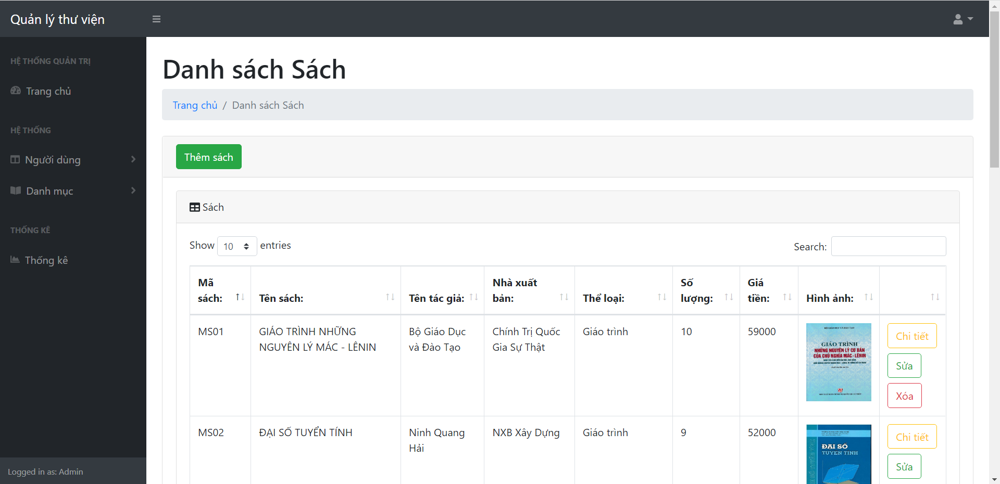
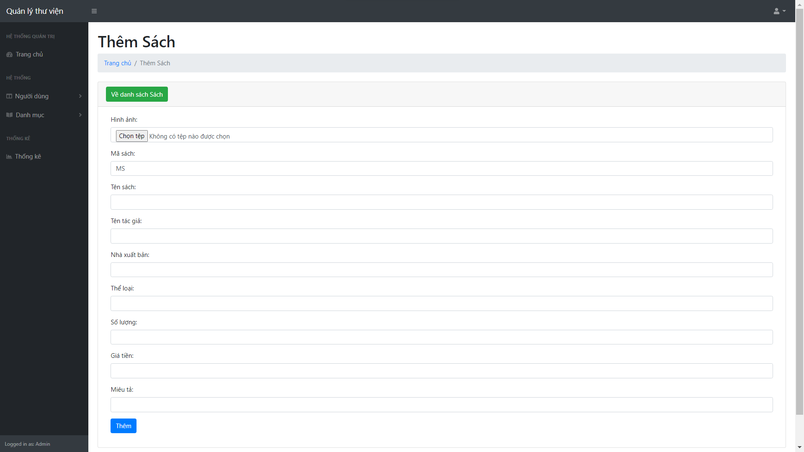
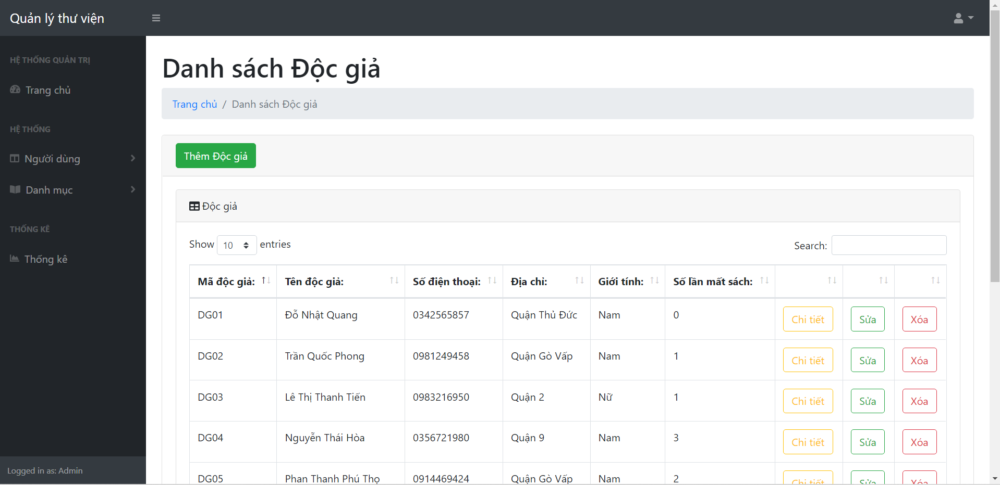
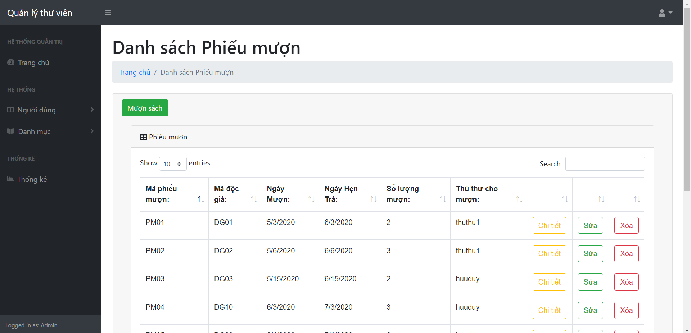
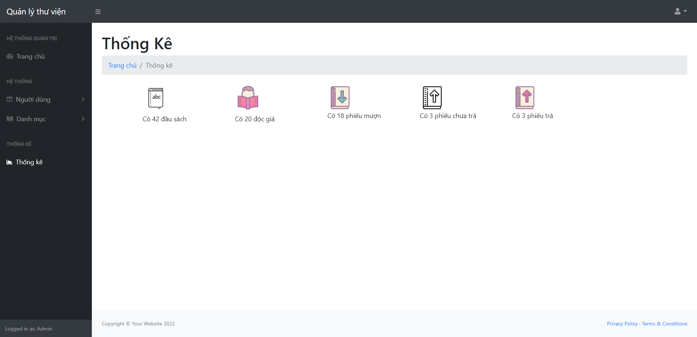

# PHẦN MỀM QUẢN LÝ THƯ VIỆN
## Giới thiệu phần mềm
### Ứng dụng quản lý thư viện bao gồm các chức năng sau:
#### - Quản lý sách: Thêm sách mới vào thư viện, xem chi tiết thông tin sách, sửa thông tin của sách, xóa sách khỏi thư viện, tìm kiếm sách trong thư viện.
#### - Quản lý độc giả: Thêm độc giả, xem chi tiết thông tin độc giả, sửa thông tin của độc giả, xóa độc giả, tìm kiếm độc giả.
#### - Quản lý phiếu mượn: Thêm phiếu mượn, thêm chi tiết phiếu mượn, xem phiếu mượn, sửa phiếu mượn, xóa phiếu mượn, tìm kiếm phiếu mượn.
#### - Quản lý phiếu trả: Thêm phiếu trả, xem chi tiết phiếu trả, sửa thông tin phiếu trả, xóa phiếu trả.
#### - Thống kê: Thống kê số lượng độc giả, thống kê số lượng sách, thống kê số lượng phiếu mượn, thống kê số lượng phiếu chưa trả, thống kê số lượng phiếu trả.
## Xây dựng phần mềm
#### Công nghệ lập trình: ASP .Net MVC
#### Công cụ lập trình: Visual Studio
#### Cơ sở dữ liệu: MySQL, PHP
#### Ngôn ngữ lập trình: C Sharp (C#)
## Minh họa các chức năng
### Danh sách sách

### Thêm sách

### Danh sách độc giả

### Quản lý mượn sách

### Thống kê

